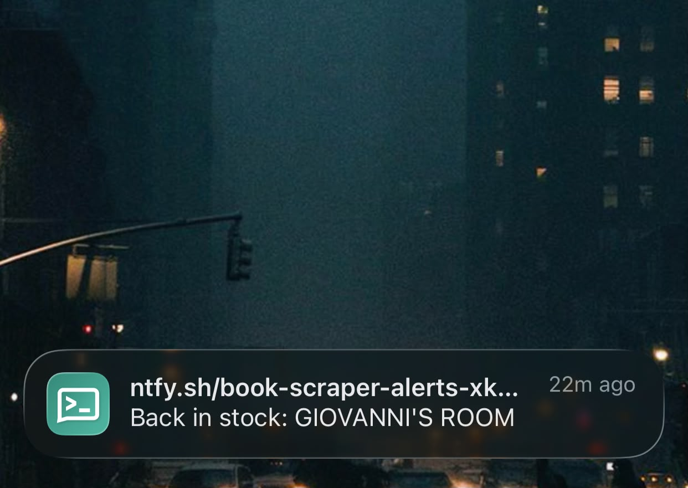
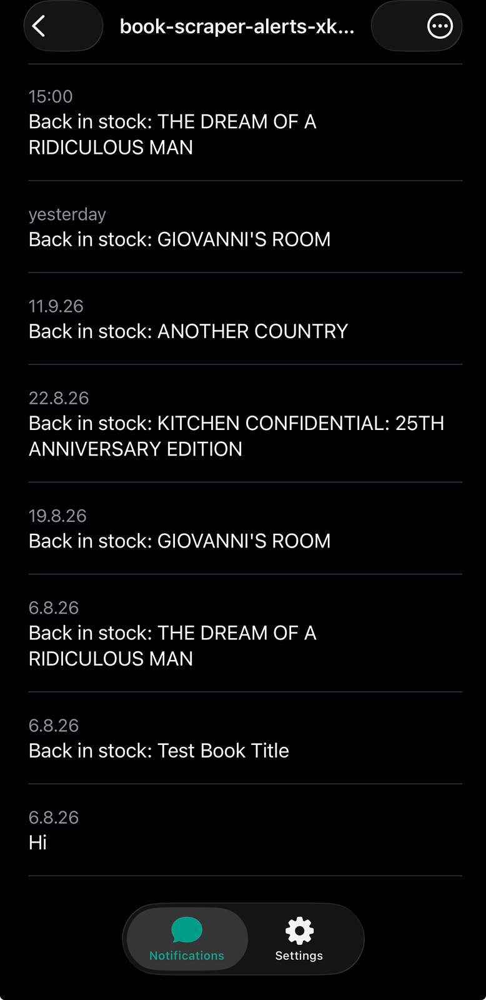
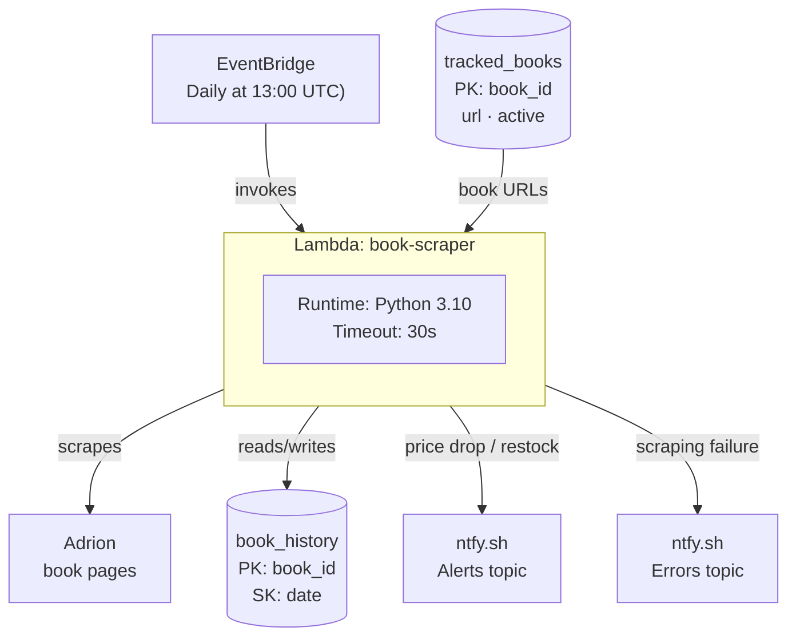

# Book Price & Stock Tracker

## Why I built it

Checking prices and stock manually is repetitive. I wanted the process to run itself and only notify me when something needs my attention, like a price drop a restock or an error, not "nothing changed today."

## Project Summary

A serverless price and stock tracker for books from Adrion bookstore. It runs automatically once a day, scrapes a configurable list of book pages, detects price drops (≥5%) and restocks, and sends notifications via ntfy. Built on AWS (Lambda, DynamoDB, EventBridge) as a learning project covering serverless architecture, web scraping, and cloud debugging.

---

## What happens automatically

1. EventBridge triggers the Lambda every day at 13:00 UTC
2. Lambda fetches each tracked book's page
3. Current price/stock is compared against the latest stored state
4. Changes are saved to DynamoDB
5. Price drops (≥5%) and restocks trigger a push notification via ntfy
6. **Failure isolation:** each book is checked independently. If one book fails to scrape, the error is reported and the remaining books are still checked.

---

## Example notifications

**Restock alert**

**Notification history**

---

## Architecture

### Services Used

**AWS Lambda**
Executes the scraping, comparison, and notification logic on each scheduled invocation.

- Runtime: Python 3.10, 128MB memory, 30-second timeout
- Dependencies (`requests`, `beautifulsoup4`) are not included in Lambda's base runtime - packaged via a custom Lambda Layer (`requests-bs4-layer`, x86_64, built with `pip install -t python/`)

> **Note:** `boto3` is pre-installed in the Lambda Python runtime and requires no extra setup. `requests` and `beautifulsoup4` are not included by default. They're provided via the custom Lambda Layer described above.

**Amazon DynamoDB**
Two tables, each with a schema chosen for a specific access pattern:

- **`book_history`** - time-series price/stock data
  - Partition key: `book_id` (String)
  - Sort key: `date` (String, `YYYY-MM-DD`)
  - _Design rationale: the composite key enables an efficient `Query` to retrieve the most recent record for a given book (`ScanIndexForward=False, Limit=1`), without reading the entire table. A single-key design was ruled out, since it would destroy historical data needed for trend comparison.

- **`tracked_books`** - stores the list of books that are currently being monitored
  - Partition key: `book_id` (String)
  - Attributes: `url` (String), `active` (Boolean)
  - Design rationale: Adding, removing, or pausing a tracked book requires no redeployment - a decision to avoid hardcoding mutable state into source.

**Amazon EventBridge**
Cron-based scheduler, replacing the need for a manually-triggered or externally-polled invocation.

- Schedule: `cron(0 13 * * ? *)` - daily at 13:00 UTC
- Default retry policy left unchanged (185 attempts / 24hr max age)

**IAM**
Execution role `book-scraper-role`, extended with `AmazonDynamoDBFullAccess` to permit read/write on both tables.

- **Known deviation from least-privilege:** a scoped custom policy (restricted to the two specific table ARNs and required actions only) would be more correct for a production system. `AmazonDynamoDBFullAccess` was used here for development.

**ntfy.sh** (third-party, not AWS)
Push notification delivery for detected price/stock changes and scraping failures.

- **Why not Amazon SES:** SES was initially considered for email notifications, but messages were not reliably reaching recipients despite successful send requests from SES. Troubleshooting email deliverability would require additional configuration, such as domain verification and email authentication (SPF/DKIM/DMARC), which was outside the scope of the project. ntfy.sh was used instead because it provides simple HTTP based push notifications without requiring email infrastructure.
- **Note:** ntfy topics rely on the topic name for access control, meaning anyone with the topic name can read or send messages. Separate topics are used for alerts and errors to limit exposure if one is compromised.

---

## Installation

This project runs entirely on AWS infrastructure, there's no local app to install. To recreate it:

1. Create two DynamoDB tables (see schemas above: `book_history`, `tracked_books`)
2. Create a Lambda function (Python 3.10)
3. Build a Lambda Layer for `requests` and `beautifulsoup4`:
   - Install both packages into a folder named exactly `python/` (Lambda requires this exact folder name at the root of the zip): `pip install requests beautifulsoup4 -t python/`
   - Compress the `python/` folder into a `.zip` file
   - Upload the `.zip` as a new Lambda Layer (architecture: x86_64, matching the function)
   - Attach the Layer to the Lambda function
4. Attach `AmazonDynamoDBFullAccess` to the function's execution role
5. Set environment variables: `NTFY_TOPIC_URL`, `NTFY_ERROR_TOPIC_URL`
6. Create an EventBridge scheduled rule targeting the function (`cron(0 13 * * ? *)`)
7. Add books to track via items in the `tracked_books` table (`book_id`, `url`, `active`)

---

## Usage

The project is currently operated through the AWS Console. A CLI or UI is not provided at this time, though automation via `boto3` can be added for scripted workflows.

- **Add a book to track:** insert an item into `tracked_books` - `book_id`, `url`, `active: true`
- **Pause a book:** set its `active` field to `false` (keeps history, stops future scraping)
- **View price/stock history:** query `book_history` by `book_id`
- **Alerts:** arrive automatically via ntfy - subscribe to the relevant topic in the ntfy app

---

## Features

- Automated daily scraping - no manual trigger needed
- Price-drop detection with a configurable threshold (≥5%)
- Restock detection (stock transitioning from 0  → available)
- Per-book error isolation - one book failing to scrape doesn't stop the rest
- Dynamic book list - add/remove/pause tracked books without redeploying code
- Push notifications via ntfy, split into separate alerts and errors channels

---

## Tech Stack / Built With

- **AWS:** Lambda, DynamoDB, EventBridge, IAM
- **Python 3.10**, `boto3`, `requests`, `BeautifulSoup4`
- **ntfy.sh** - notification delivery

---

## Known limitations & next steps

- IAM permissions use `AmazonDynamoDBFullAccess` rather than a scoped least-privilege policy
- No CloudWatch Alarm coverage for total function failure. Currently only per-book failures inside the loop are caught and reported
- No automated tests
- Book list must be managed manually via the DynamoDB console; a small script or API for adding books would reduce friction at larger scale

---

## Contributing

Personal learning project - not currently accepting contributions.

---

## License

MIT License

---

## Acknowledgments

Built as a learning project
